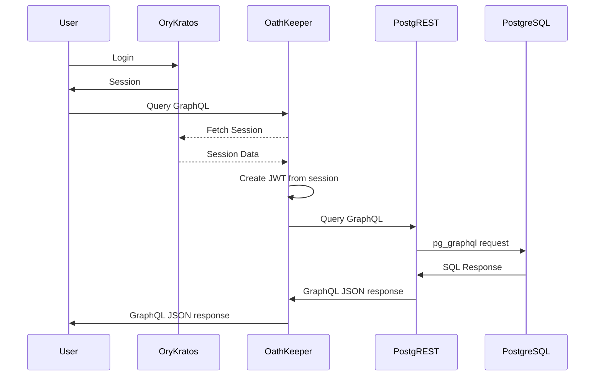

# sushii-ts-services

Microservices for sushii bot.

Discord Gateway -> RabbitMQ -> sushii-ts-interactions

Persistence:
* PostgreSQL -> pg_graphql -> PostgREST

All services e.g. sushii-ts-interactions and sushii-web that require postgres
data will query graphql/rest via PostgREST

Authentication:
* User -> Ory Kratos -> Ory Oathkeeper -> JWT -> PostgREST
* Service -> JWT -> PostgREST



## Packages

* `sushii-data` - REST API for guild / user data
* `sushii-data-client` - Typed client to make requests to sushii-data
* `sushii-ts-interaction` - Stateless interactions handler


## JWK RS256

Key required for Ory OathKeeper to create signed JWTs to pass to PostgREST.

```bash
docker run oryd/oathkeeper:v0.38.16-beta.1 credentials generate --alg RS256 > jwks.json
```
