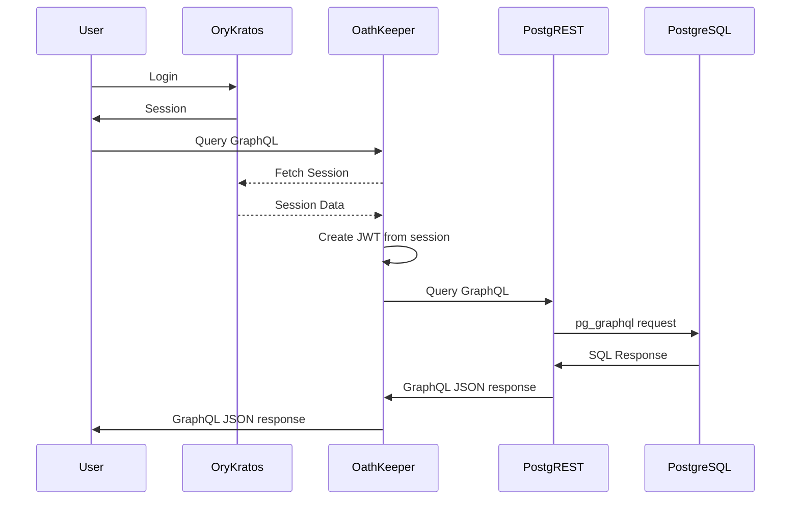

# sushii-ts-services

Microservices for sushii bot.

Discord Gateway -> RabbitMQ -> sushii-ts-interactions

Persistence:
* PostgreSQL -> PostGraphile

All services e.g. sushii-ts-interactions and sushii-web that require postgres
data will query graphql via PostGraphile

Authentication:
* User -> Ory Kratos -> Ory Oathkeeper -> JWT -> PostGraphile
* Service -> JWT -> PostGraphile



## Packages

* `sushii-data` - REST API for guild / user data
* `sushii-data-client` - Typed client to make requests to sushii-data
* `sushii-ts-interaction` - Stateless interactions handler

## JWK, JWTs, and Machine Tokens

A JWK is required for Ory OathKeeper to create signed JWTs to pass to PostgREST.

sushii services also require JWT for authentication with PostgREST. A JWT token
can be manually created with
[`jose-util`](https://github.com/go-jose/go-jose/tree/v3/jose-util) with the role
claim set to `sushii_admin`. Requests from sushii internal services do not have to go
through Ory Oathkeeper, as Oathkeeper is primarily just to add JWT tokens for
user flow for authentication and authorization. JWT is **not** used for
sessions.

```bash
# generate PEM format priv/pub key pair
ssh-keygen -t ecdsa -b 521 -m PEM

# Convert pubkey to PEM format
ssh-keygen -f ecdsa.pub -e -m pem

echo '{"role": "sushii_admin"}' | jose-util sign --alg ES512 --key ecdsa

echo 'ey...' | jose-util verify --key ecdsa.pub
```

This generated key should be passed to PostgREST via the Authorization header:

`Authorization: Bearer <token>`
